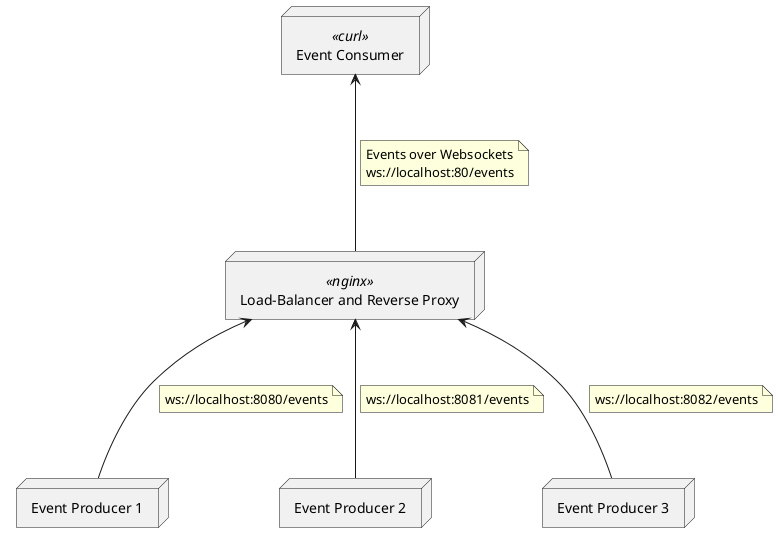
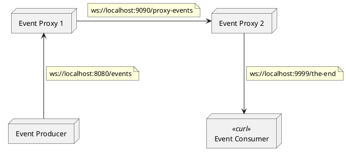

# wsevent

This project aims to show how an event-driven architecture can be realized without complex message oriented middlewares (MoMs), by relying only on reverse proxied point-2-point connections. 
## Scenario: Client consumes over reverse proxy

The basic idea is that an event consumer relies on a URL for a given type of events.
Event Streams are unidirectional producer-driven messages.
From the consumer's perspective the Event-URL is comparable to a "topic" in context of architectures on basis of MoMs.
The following scenario shall help to understand this concept and also provide some example code.



Start three dummy event producer services on ports 8080 to 8081:

```
go run svcdummy -serve-address localhost:8080 &
go run svcdummy -serve-address localhost:8081 &
go run svcdummy -serve-address localhost:8082 &
```

Start the loadbalancer and reverse proxy

```
./wsproxy.sh
```

Start multiple clients using the loadbalancer

```
./wsclient.sh 80
```

## Scenario: Producer -> ProxyCLient -> Consumer

The second scenario shows how different service instances can be chained while they still behave as loosley coupled as possible.
For the sake of simplicity we simulate downstream services in form of simple event proxies passing events directly and unchanged to their consumers.
To keep things simple we also removed the reverse proxy in this scenario.



Start one event producing service instance 

* that writes random strings on `ws://localhost:8080/events`:

```
go run svcdummy
```

Start one event producing service instance 

* reading from `ws://localhost:8080/events`, and 
* proxying to `ws://localhost:9090/proxy-events`

```
go run svcdummy -consume-path events -consume-address localhost:8080 -serve-address localhost:9090 -serve-path proxy-events -no-produce
```

Start a second service instance that acts as a simple event forwarder

* reading from `ws://localhost:9090/proxy-events`, and 
* proxying to `ws://localhost:9999/the-end`

```
go run svcdummy -consume-path proxy-events -consume-address localhost:9090 -serve-address localhost:9999 -serve-path the-end -no-produce
```

Start the end consumer:
```
./wsclient.sh 9999
```
